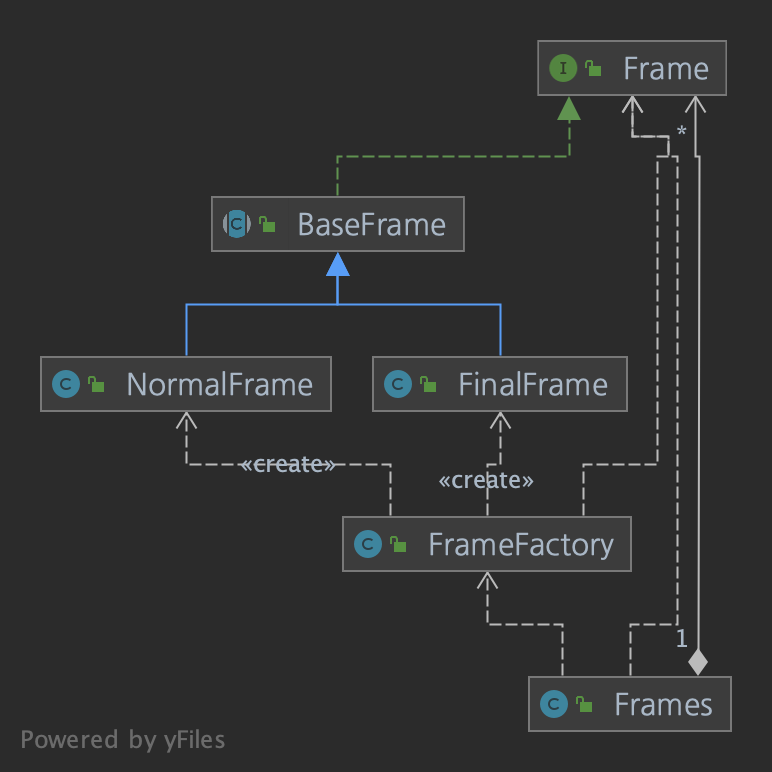
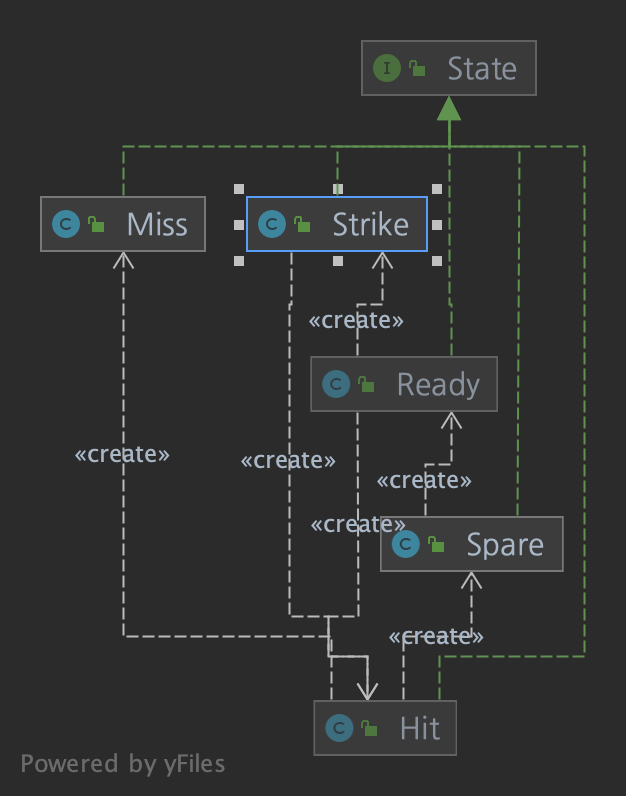
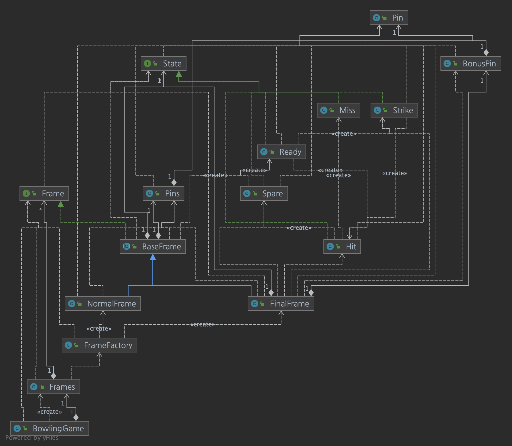

# 볼링 게임 점수판

## 진행 방법

* 볼링 게임 점수판 요구사항을 파악한다.
* 요구사항에 대한 구현을 완료한 후 자신의 github 아이디에 해당하는 브랜치에 Pull Request(이하 PR)를 통해 코드 리뷰 요청을 한다.
* 코드 리뷰 피드백에 대한 개선 작업을 하고 다시 PUSH한다.
* 모든 피드백을 완료하면 다음 단계를 도전하고 앞의 과정을 반복한다.

## 온라인 코드 리뷰 과정

* [텍스트와 이미지로 살펴보는 온라인 코드 리뷰 과정](https://github.com/next-step/nextstep-docs/tree/master/codereview)

## 1단계 - 질문 삭제하기 기능 리팩토링

- 질문 삭제하기 요구사항
	- 질문 데이터를 완전히 삭제하는 것이 아니라 데이터의 상태를 삭제상태(deleted - boolean type)로 변경한다.
	- 로그인 사용자와 질문한 사람이 같은 경우 삭제 가능하다.
	- 답변이 없는 경우 삭제가 가능하다.
	- 질문자와 답변 글의 모든 답변자 같은 경우 삭제가 가능하다.
	- 질문을 삭제할 때 답변 또한 삭제해야 하며, 답변의 삭제 또한 삭제 상태(deleted)를 변경한다.
	- 질문자와 답변자가 다른경우 답변을 삭제할 수 없다.
	- 질문과 답변 삭제 이력에 대한 정보를 `DeleteHistory`를 활용해 남긴다.

- 프로그래밍 요구사항
	- qna.service.QnaService의 deleteQuestion()는 앞의 질문 삭제 기능을 구현한 코드이다.
	- 이 메소드는 단위 테스트하기 어려운 코드와 단위 테스트 가능한 코드가 섞여 있다.
	- 단위 테스트하기 어려운 코드와 단위 테스트 가능한 코드를 분리해 단위 테스트 가능한 코드 에 대해 단위 테스트를 구현한다.

```java
public class QnAService {
    public void deleteQuestion(User loginUser, long questionId) throws CannotDeleteException {
        Question question = findQuestionById(questionId);
        if (!question.isOwner(loginUser)) {
            throw new CannotDeleteException("질문을 삭제할 권한이 없습니다.");
        }

        List<Answer> answers = question.getAnswers();
        for (Answer answer : answers) {
            if (!answer.isOwner(loginUser)) {
                throw new CannotDeleteException("다른 사람이 쓴 답변이 있어 삭제할 수 없습니다.");
            }
        }

        List<DeleteHistory> deleteHistories = new ArrayList<>();
        question.setDeleted(true);
        deleteHistories.add(new DeleteHistory(ContentType.QUESTION, questionId, question.getWriter(), LocalDateTime.now()));
        for (Answer answer : answers) {
            answer.setDeleted(true);
            deleteHistories.add(new DeleteHistory(ContentType.ANSWER, answer.getId(), answer.getWriter(), LocalDateTime.now()));
        }
        deleteHistoryService.saveAll(deleteHistories);
    }
}
```

- 힌트1
	- 객체의 상태 데이터를 꺼내지(get)말고 메시지를 보낸다.
	- 규칙 8: 일급 콜렉션을 쓴다.
	- Question의 List를 일급 콜렉션으로 구현해 본다.
	- 규칙 7: 3개 이상의 인스턴스 변수를 가진 클래스를 쓰지 않는다.
	- 인스턴스 변수의 수를 줄이기 위해 도전한다.

- 힌트2
	- 테스트하기 쉬운 부분과 테스트하기 어려운 부분을 분리해 테스트 가능한 부분만 단위테스트한다.

> TDD 순서(잘 안지켜짐)

- 엔티티 내에 List<> 타입의 필드를 일급 컬렉션으로 분리
	- List<Answer> -> Answers

- Question 과 해당 Question에 대한 Answers가 동일한 작성자인 경우 삭제 가능
	- 권한 여부(checkAuthorization)

- 질문 삭제 시 답변 또한 삭제, 답변의 삭제 또한 삭제 상태 변경
	- setter 삭제 후, 삭제 필드에 대한 수정을 관련 로직에 포함

## QnA 피드백 강의

- 비즈니스 로직이 Service Layer에 집중 되어 있다.
- 비즈니스 로직은 Mock을 통해 단위 테스트 할 수는 있다.
	- 하지만 Mock에 대한 학습 비용, 테스트 코드 작성에 대한 부담이 커진다.

- 비즈니스 로직을 OOP로 리펙토링하기 위해서는 단위 테스트 코드가 불가피하게 필요하다.
	- 해당 테스트 코드를 OOP로 리펙토링하면서 테스트가 깨지지 않도록 한다.
	- 비즈니스 코드는 트랜잭션, 권한, 메시지 보내는 코드에 대한 로직만 갖고 있도록 한다.

- Mock은 최소화하고 JUnit 테스트를 통해 개발한다.
- 서비스를 최소화하고, 도메인으로 구성하기

- 도메인 설계 -> 구현의 반복
	- 요구사항 분석 후, 도메인 설계


- TDD로 구현하면서 인터페이스, 도메인 설계
	- 반복을 통한 설계 개선

- 테이블과 도메인 설계는 같지 않다.
	- 도메인 설계를 테이블과 1:1로 매핑되면 그건 객체지향 설계가 아니다.

> ORM 프레임워크를 활용할 때의 설계, 개발 프로세스

- [링크](https://youtu.be/VjbBGjVRxfk)

## 2단계 - 볼링 점수판(그리기)

- [볼링 규칙 익히기](docs/bowling-rule.md)
	- 거터
	- 오픈
	- 스페어
	- 스트라이크(더블)
	- 스트라이크(터키)
	- 스트라이크(퍼펙트)
	- 10 프레임 점수 계산법

### 기능 요구사항

- 최종 목표는 볼링 점수를 계산하는 프로그램을 구현한다. 1단계 목표는 점수 계산을 제외한 볼링 게임 점수판을 구현하는 것이다.
- 각 프레임이 스트라이크이면 "X", 스페어이면 "9 | /", 미스이면 "8 | 1", 과 같이 출력하도록 구현한다.
	- 스트라이크(strike) : 프레임의 첫번째 투구에서 모든 핀(10개)을 쓰러트린 상태
	- 스페어(spare) : 프레임의 두번재 투구에서 모든 핀(10개)을 쓰러트린 상태
	- 미스(miss) : 프레임의 두번재 투구에서도 모든 핀이 쓰러지지 않은 상태
	- 거터(gutter) : 핀을 하나도 쓰러트리지 못한 상태. 거터는 "-"로 표시
- 10 프레임은 스트라이크이거나 스페어이면 한 번을 더 투구할 수 있다.

- 구현 시작 방법
	- 볼링 게임의 점수 계산 방식 아는 사람은 바로 구현을 시작한다.
	- 점수 계산 방식을 모르는 사람은 구글에서 "볼링 점수 계산법"과 같은 키워드로 검색해 볼링 게임의 점수 계산 방식을 학습한 후 구현을 시작한다.

### 프로그램 실행 결과

```text
플레이어 이름은(3 english letters)?: PJS
| NAME |  01  |  02  |  03  |  04  |  05  |  06  |  07  |  08  |  09  |  10  |
|  PJS |      |      |      |      |      |      |      |      |      |      |

1프레임 투구 : 10
| NAME |  01  |  02  |  03  |  04  |  05  |  06  |  07  |  08  |  09  |  10  |
|  PJS |  X   |      |      |      |      |      |      |      |      |      |

2프레임 투구 : 8
| NAME |  01  |  02  |  03  |  04  |  05  |  06  |  07  |  08  |  09  |  10  |
|  PJS |  X   |  8   |      |      |      |      |      |      |      |      |

2프레임 투구 : 2
| NAME |  01  |  02  |  03  |  04  |  05  |  06  |  07  |  08  |  09  |  10  |
|  PJS |  X   |  8|/ |      |      |      |      |      |      |      |      |

3프레임 투구 :  7
| NAME |  01  |  02  |  03  |  04  |  05  |  06  |  07  |  08  |  09  |  10  |
|  PJS |  X   |  8|/ |  7   |      |      |      |      |      |      |      |

3프레임 투구 :  : 0
| NAME |  01  |  02  |  03  |  04  |  05  |  06  |  07  |  08  |  09  |  10  |
|  PJS |  X   |  8|/ |  7|- |      |      |      |      |      |      |      |

...
```

### 프로그래밍 요구사항

- 객체지향 생활 체조 원칙을 지키면서 프로그래밍한다.

### 객체지향 생활 체조 원칙

- 규칙 1: 한 메서드에 오직 한 단계의 들여쓰기만 한다.
- 규칙 2: else 예약어를 쓰지 않는다.
- 규칙 3: 모든 원시값과 문자열을 포장한다.
- 규칙 4: 한 줄에 점을 하나만 찍는다.
- 규칙 5: 줄여쓰지 않는다(축약 금지).
- 규칙 6: 모든 엔티티를 작게 유지한다.
- 규칙 7: 3개 이상의 인스턴스 변수를 가진 클래스를 쓰지 않는다.
- 규칙 8: 일급 콜렉션을 쓴다.
- 규칙 9: 게터/세터/프로퍼티를 쓰지 않는다.

### 힌트

- 객체 단위를 가장 작은 단위까지 극단적으로 분리하는 시도를 해본다.
- 1 ~ 9 프레임을 NormalFrame, 10 프레임을 FinalFrame과 같은 구조로 구현한 후 Frame을 추가해 중복을 제거해 본다.
- 다음 Frame을 현재 Frame 외부에서 생성하기 보다 현재 Frame에서 다음 Frame을 생성하는 방식으로 구현해 보고, 어느 구현이 더 좋은지 검토해 본다.

### 볼링 게임 설계 하기

- 볼링 게임은 10개의 프레임으로 구성
	- 10 Frame

- 각 프레임은 10개의 핀을 쓰러뜨리기 위해 2개의 시도를 할 수 있다.
	- 1 프레임 당 2번의 시도

- 초구에 모두 10개의 핀을 쓰러뜨린 경우 스트라이크
	- 각 프레임 당 초구에 10점 시 스트라이크
	- 다음 프레임 2구까지 점수를 추가하여 점수 등록 연속 시 3개 프레임까지의 점수를 합산하여 등록

- 2구에 10개의 핀을 모두 쓰러뜨린경우 스페어
	- 각 프레임 당 2구에 10점 달성 시 스페어
	- 스페어 처리시 다음 프레임 초구까지 점수까지 합산된 점수로 등록

- 10 프레임은 스페어 시 3구 기회를 얻을 수 있다.

> 객체 지향 설계 해보기

- 코드 설계
	- BowlingApplication
		- 전체적인 비즈니스 코드를 담당
	
	- BowlingGame
		- 게임에 대한 퍼블릭 인터페이스 제공
	
	- Frame
	    - BaseFrame 
			- NormalFrame
			- FinalFrame
		- FrameFactory

	- Frames
		- 프레임 관련 일급 컬렉션
		- 투구, 다음 프레임 추가
	
	

	- State
	    - 투구, 1 ~ 9라운드 출력, 10 라운드 출력
		- Ready
		- Hit
		- Miss
		- Spare
		- Strike
	
	
  
	- Pin
	    - 투구 시 넘어진 핀에 대한 관리
		
	- BonusPin
	    - 보너스 투구
	
	- Pins
		- 초구
		- 2구 (1 ~ 9 라운드, 10 라운드) 
	
> 투구 상태(State)에 대한 고민

- 투구 전 상태(Ready)
- 투구 시 상태(Hit)
- 투구 결과 값에 대한 상태(Strike, Spare, Miss)

			Ready
			/   \
		 Hit     Strike
		/   \
	Spare   MISS
			   \
                GUTTER


> 10 프레임 3구 조건

- 초구, 2구에 Strike 또는 Spare 상태가 있는 경우 3구 시도 가능



