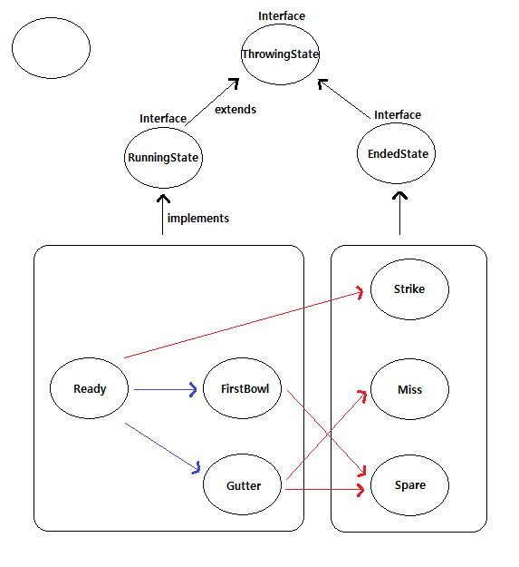

# 볼링 게임 점수판
## 진행 방법
* 볼링 게임 점수판 요구사항을 파악한다.
* 요구사항에 대한 구현을 완료한 후 자신의 github 아이디에 해당하는 브랜치에 Pull Request(이하 PR)를 통해 코드 리뷰 요청을 한다.
* 코드 리뷰 피드백에 대한 개선 작업을 하고 다시 PUSH한다.
* 모든 피드백을 완료하면 다음 단계를 도전하고 앞의 과정을 반복한다.

## 요구사항
* 2단계
    * 입력
        * [x] 플레이어 이름을 입력받기(영문 세글자)
        * [x] 허용되지 않은 이름이 입력된 경우 예외 발생
        * [x] 허용되지 않은 이름이 입력된 경우 재입력받기
        * [x] 총 10번의 프레임 각각에 대해 2번의 투구 입력받기
        * [x] 음수 혹은 10 초과의 투구 입력된 경우 예외 발생
        * [x] 음수 혹은 10 초과의 투구 입력된 경우 재입력받기
    * 도메인
        * [x] 한 프레임 구현(프레임당 2번의 투구)
        * [x] 전체 게임 구현(10번의 프레임 반복)
        * [x] 게임 결과 저장
    * 출력
        * [x] 시작 전 출력
        * [x] 총 10번의 프레임 각각에 대해 2번씩 결과 출력하기(간격 일정 유지)
        * [x] 요구사항에 맞게 출력
* 3단계
    * 리팩토링
        * [x] 도메인 외부 if문 제거([상태 패턴 도입](#상태-패턴-도입))
    * 도메인
        * [x] 10라운드의 경우 3번 투구
        * [ ] 프레임별 누적 점수 계산
    * 출력
        * [ ] 점수 출력

### 상태 패턴 도입
 

## 온라인 코드 리뷰 과정
* [텍스트와 이미지로 살펴보는 온라인 코드 리뷰 과정](https://github.com/next-step/nextstep-docs/tree/master/codereview)